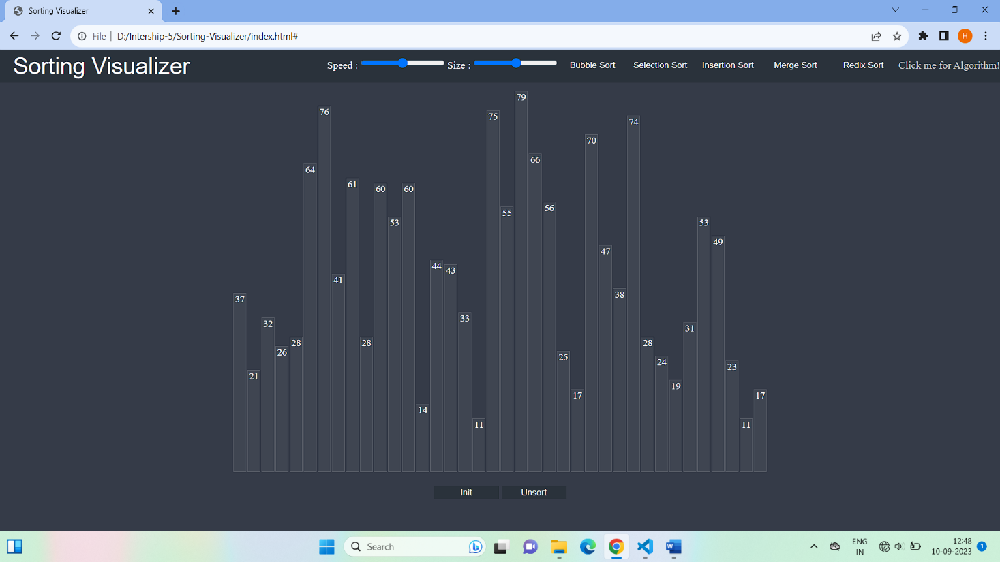
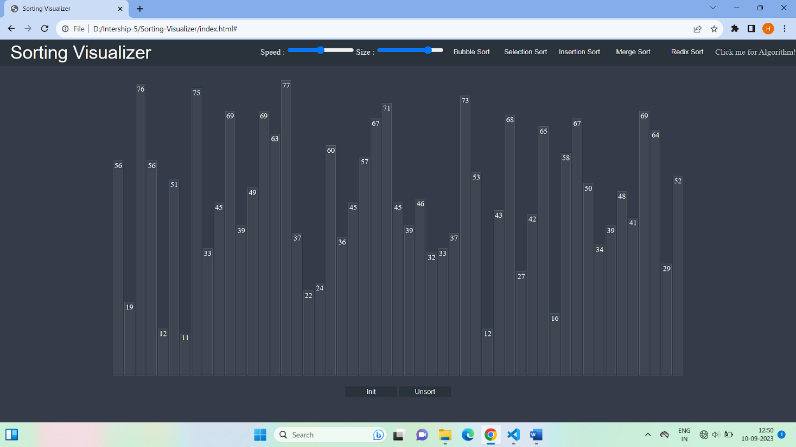
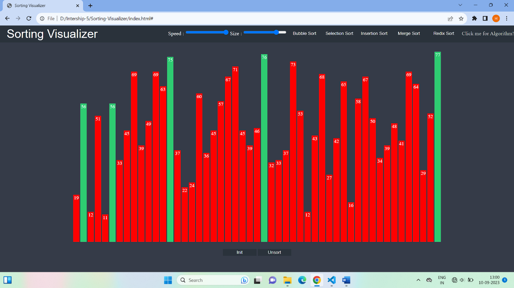
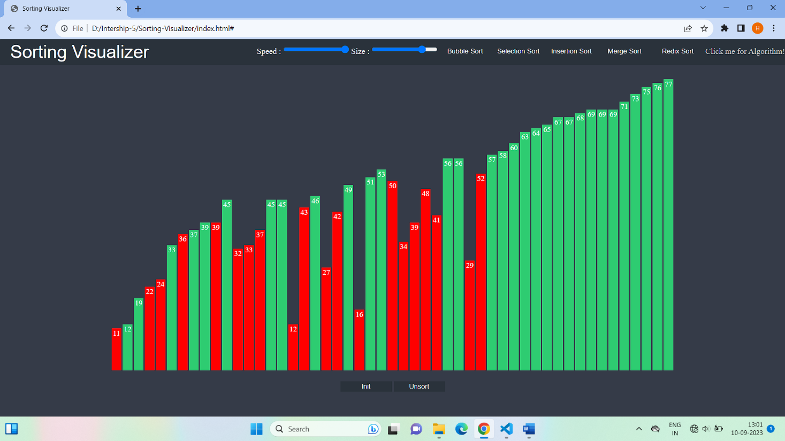
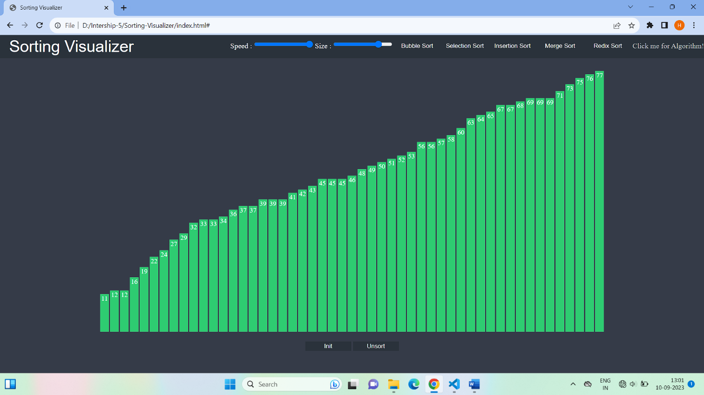

# 📊 Sorting Visualizer

An interactive **web-based visualization tool** for learning how various sorting algorithms work. Built using **HTML**, **CSS**, and **JavaScript**, this project helps users understand sorting through animated, real-time visualizations.

---

## 🎯 Objective

This project aims to provide a hands-on and intuitive approach to understanding the internal working of popular sorting algorithms. It is designed for computer science students, educators, and enthusiasts.

---

## 🚀 Features

- 📌 Visualize sorting algorithms step-by-step:
  - **Bubble Sort**
  - **Selection Sort**
  - **Insertion Sort**
  - **Merge Sort**
  - **Radix Sort**
- 🎛️ Adjustable speed control
- 📐 Adjustable number of bars (data size)
- 🔁 Shuffle/Unsort functionality
- 🧠 View sorting algorithm logic in popup
- 💻 Responsive and interactive UI

---

## 🛠️ Technologies Used

- **HTML5** – Page structure
- **CSS3** – Styling and layout
- **JavaScript (Vanilla)** – Logic, DOM manipulation, and animation
- **Visual Studio Code** – Development environment
- **Web Browsers** – Chrome, Firefox, Edge (for testing and viewing)

---

## 📷 Screenshots

### 🔹 Homepage with control panel and bars


### 🔹 Set the bar size and initialize it


### 🔹 Set the speed of sorting and perform the bubble sort



### 🔹 Final sorted result


### 🔹 Click the algorithm link and see the algorithm of bubble sort in popup box


---

## 🧠 How It Works

- Each bar represents a numeric value.
- Bars are randomized on initialization.
- When a sorting algorithm is selected, bars are animated to reflect each step of sorting:
  - Comparisons are highlighted.
  - Swaps are animated.
  - Final sorted bars are shown in order.
- Users can adjust animation speed and bar count using sliders.

---

## 💡 How to Run the Project

1. Download or clone the repository:
   ```bash
   git clone https://github.com/Heena-Solanki12/sorting-visualizer.git

2. Navigate to the project folder.

3. Open index.html in your preferred web browser.

No additional setup is required. Works on all modern browsers.

---

## 🧪 Internship Context

Internship Period: 27th July – 30th August 2023

Institute: Government Polytechnic, Porbandar

Intern: Heena B Solanki (Enrollment: 216270307009)

Mentor: Mr. Kunal Thanki

This project was developed as part of a diploma engineering internship under the Computer Engineering Department to gain real-world experience in JavaScript and frontend web development.

---

## 📚 References
GeeksForGeeks – Sorting Algorithms

YouTube – Code Drifter

GitHub – Abhishek Prakash

Radu Mariescu-Istodor – Visualizing Algorithms

---
